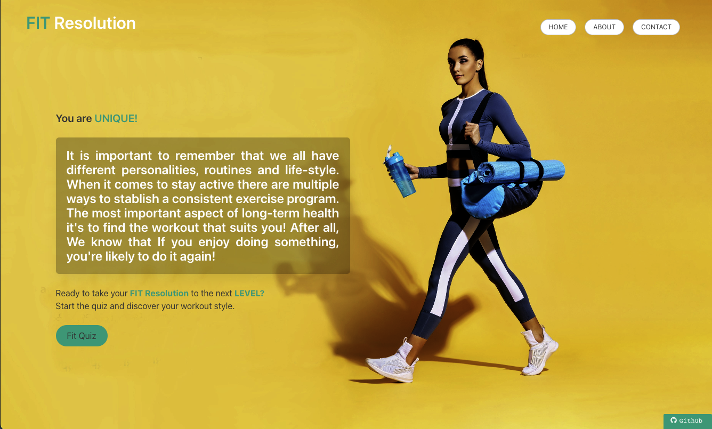
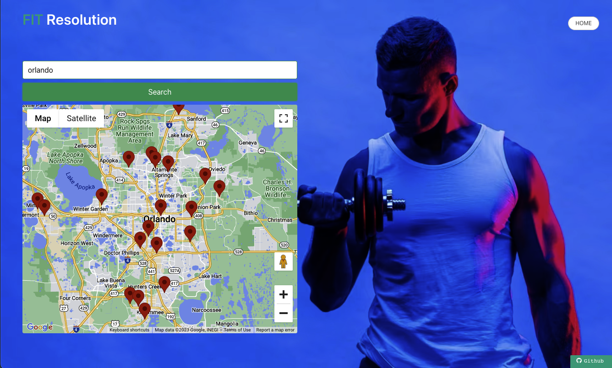

<h1 align="center">Fit Resolution</h1>

Interactive Exercise Website

ScreenShots 🏆

🔭 [Deployment Website](https://jonjon50.github.io/Fit-Resolution/) 🔭

**Hello World 👋**

- One of my biggest motivations for the project was incrementing the API into all user locations for better experiences. 
- Using Geofetch for everyone to be a part of the interaction. Knowing the our fittest goals is important. Through this built we are focus on a functionality that is efficient and effective while saving lives. 
- Protecting loved ones from obesity and generational health problems. By achieving this goal, made us better coder and people by changing the world one code at a time.

 🏆 Collaborators/Creditors

- [Profile]( https://github.com/MilenaSilveira   " Milena Silveira ") -- Milena Silveira
- [Profile]( https://github.com/tanglero4  " Tiffany Anglero ") -- Tiffany Anglero
- [Profile]( https://github.com/darioelao  " Dario Elao ") -- Dario Elao
- [Profile]( https://github.com/JonJon50  " John Hagens ") -- John Hagens

- JavaScript
- Jquery
- Bootstrap
- HTML
- CSS
- Bulma

- [x] Reliable API // This is done 
- [x] Authentication // This is done
- [x] Local Storage // This is done 

- 👨‍💻 We are Coding BootCamp Alumni of [UCF](https://www.ucf.edu/students/)

Contributions, issues, and feature requests are welcome! 🤝
Give a ⭐️ if you like this project!